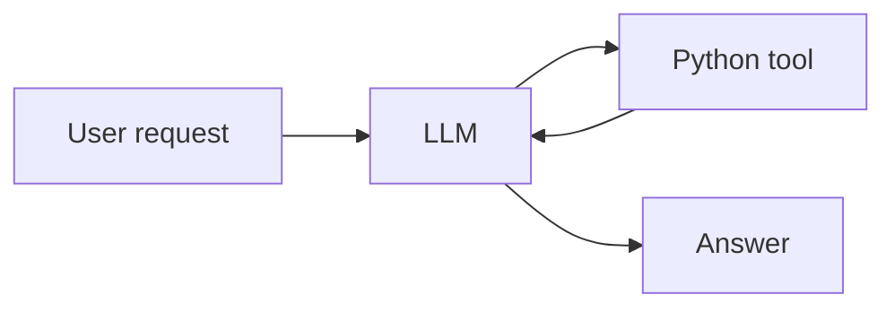

# Stage 1 — Single tool agent

```mermaid
flowchart LR
  U[User request] --> L[LLM]
  L --> T[Python tool]
  T --> L
  L --> R[Answer]
```

**Challenge:** Call a typed Python tool with valid arguments. No memory, retries, or multi-agent complexity.
