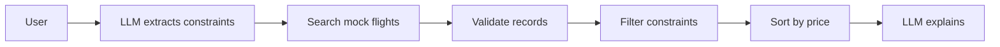

# Stage 2 — Deterministic validation and ranking

```mermaid
flowchart LR
  U[User] --> L[LLM extracts constraints]
  L --> S[Search mock flights]
  S --> V[Validate records]
  V --> F[Filter constraints]
  F --> P[Sort by price]
  P --> L2[LLM explains]
```

**Challenge:** Reject invalid prices, exclude overnight layovers and rank eligible flights. This corresponds to the first Python exercise.
