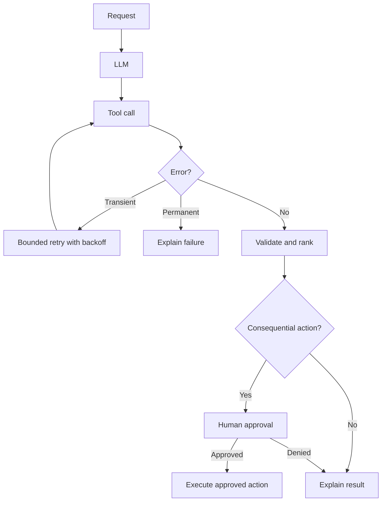

# Stage 3 — Reliability and safe actions

```mermaid
flowchart TD
  U[Request] --> L[LLM]
  L --> T[Tool call]
  T --> E{Error?}
  E -->|Transient| B[Bounded retry with backoff]
  B --> T
  E -->|Permanent| X[Explain failure]
  E -->|No| V[Validate and rank]
  V --> A{Consequential action?}
  A -->|Yes| H[Human approval]
  A -->|No| R[Explain result]
  H -->|Approved| C[Execute approved action]
  H -->|Denied| R
```

**Challenge:** Handle 429 and 5xx failures with bounded retries; never retry bookings blindly.
