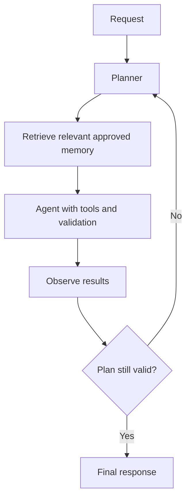

# Stage 4 — Memory and planning

```mermaid
flowchart TD
  U[Request] --> P[Planner]
  P --> M[Retrieve relevant approved memory]
  M --> A[Agent with tools and validation]
  A --> O[Observe results]
  O --> D{Plan still valid?}
  D -->|No| P
  D -->|Yes| R[Final response]
```

**Challenge:** Distinguish temporary context from persistent memory, and replan on changed assumptions.
