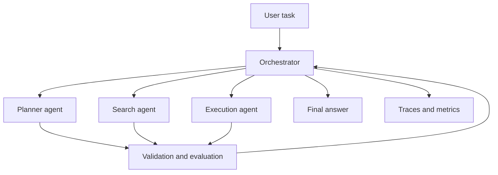

# Stage 5 — Multi-agent system

```mermaid
flowchart TD
  U[User task] --> O[Orchestrator]
  O --> P[Planner agent]
  O --> S[Search agent]
  O --> C[Execution agent]
  P --> V[Validation and evaluation]
  S --> V
  C --> V
  V --> O
  O --> R[Final answer]
  O --> T[Traces and metrics]
```

**Challenge:** Evaluate task success, tool selection, latency and cost; introduce specialist agents only when needed.
